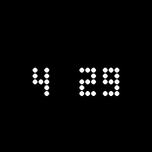

# Claude Glyph Limits

Glyph Toy for the **Nothing Phone (3)** — Claude.ai 5-hour usage on the 25×25 Glyph Matrix.

Built with the [Glyph Matrix Developer Kit](https://github.com/Nothing-Developer-Programme/GlyphMatrix-Developer-Kit).

**Device:** Nothing Phone (3) · `Glyph.DEVICE_23112` · Android 15+

## Preview

<p align="center">
  
  &nbsp;
  
</p>

<p align="center"><sub><b>Tap</b> · icon + ring &nbsp;·&nbsp; <b>Long-press</b> · reset countdown</sub></p>

- **Tap** Glyph Button → Claude icon + progress ring (% of 5h limit used)
- **Long-press** → time until reset (`4:29`, `0:45`…)

Regenerate ring preview: `python scripts/preview_ring.py --percent 50`

## How it works

The phone is **fully independent** — no PC, no Syncthing, no background sync.

1. You sign in with Claude **once** in the app (browser OAuth — no PC needed).
2. The phone stores them encrypted and refreshes the token itself (~every 8 h).
3. When you use the Glyph Toy, it fetches live usage from Anthropic's API.
4. If the network fails briefly, it shows the last successful reading (`Fuente: cache`).

See [ROADMAP.md](ROADMAP.md) for planned improvements.

## Features

- **Live usage** from `GET https://api.anthropic.com/api/oauth/usage`
- **Auto token refresh** via `POST https://claude.ai/v1/oauth/token`
- **On-demand fetch** — only when the Glyph Toy is active (connect / long-press / stale AOD)
- **Encrypted credential storage** on device (`accessToken` + `refreshToken`)

## Install (prebuilt APK)

1. Download [`releases/v2.3.3/glyph-claude-limits-v2.3.3.apk`](releases/v2.3.3/glyph-claude-limits-v2.3.3.apk)
2. `adb install -r glyph-claude-limits-v2.3.3.apk`
3. Open **Claude Glyph Limits** → **Iniciar sesión con Claude**
4. Authorize in the browser → return to the app (automatic deep link, or paste the code if prompted)
5. **Activar Glyph Toy** → drag **Claude Limits** to **Active**

After setup the PC can stay off. You only need internet on the phone when checking usage.

<details>
<summary>Advanced: paste JSON from PC</summary>

```fish
jq '.claudeAiOauth' ~/.claude/.credentials.json
```

Open **Opciones avanzadas** in the app and paste the JSON.
</details>

## Requires

- Nothing Phone (3) with Glyph Toys
- Claude.ai / Claude Code subscription (OAuth credentials)
- Internet when using the toy

### OAuth note (PC + phone)

The phone keeps its **own copy** of tokens and refreshes them independently. If you also use Claude Code on a PC with the same account, token refresh on one device can occasionally invalidate the other. Use **Volver a iniciar sesión** in the app if usage stops updating.

## Build from source

Requires **JDK 17**.

```bash
export JAVA_HOME=/path/to/jdk-17
cd glyph-claude-limits
./gradlew assembleDebug
adb install -r app/build/outputs/apk/debug/app-debug.apk
```

## Related

- [glyph-stock-ticker](https://github.com/literato1987/glyph-stock-ticker) — stocks/crypto on the matrix
- [glyph-matrix-simulator](https://github.com/literato1987/glyph-matrix-simulator) — preview layouts with the official 621-LED map
- [Glyph Matrix Developer Kit](https://github.com/Nothing-Developer-Programme/GlyphMatrix-Developer-Kit)

## License

MIT — see [LICENSE](LICENSE). Not affiliated with Anthropic or Nothing Technology.