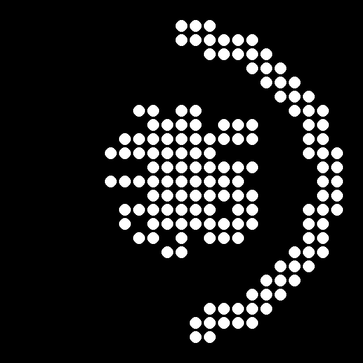

# Claude Glyph Limits

Glyph Toy for the **Nothing Phone (3)** — Claude.ai 5-hour usage on the 25×25 Glyph Matrix.

Built with the [Glyph Matrix Developer Kit](https://github.com/Nothing-Developer-Programme/GlyphMatrix-Developer-Kit).

**Device:** Nothing Phone (3) · `Glyph.DEVICE_23112` · Android 15+

## Preview

<p align="center">
  
</p>

- **Tap** Glyph Button → Claude icon + progress ring (% of 5h limit used)
- **Long-press** → time until reset (`4:29`, `0:45`…)

Regenerate preview: `python scripts/preview_ring.py --percent 50`

Fetched directly from Anthropic's OAuth usage API on the phone — no Syncthing, no PC bridge.

## Features

- **Live usage** from `GET https://api.anthropic.com/api/oauth/usage`
- **Auto token refresh** via `POST https://claude.ai/v1/oauth/token` (~every 8h)
- **On-demand fetch** — only when the Glyph Toy is active (connect / long-press / stale AOD), not in background
- **Encrypted credential storage** on device (`accessToken` + `refreshToken`)

## Install (prebuilt APK)

1. Download [`releases/v2.1.1/glyph-claude-limits-v2.1.1.apk`](releases/v2.1.1/glyph-claude-limits-v2.1.1.apk)
2. `adb install -r glyph-claude-limits-v2.1.1.apk`
3. Open **Claude Glyph Limits**
4. Paste OAuth JSON from your PC:

```fish
jq '.claudeAiOauth' ~/.claude/.credentials.json
```

5. Tap **Guardar y probar** → **Activar Glyph Toy** → drag **Claude Limits** to **Active**

## Requires

- Nothing Phone (3) with Glyph Toys
- Claude.ai / Claude Code subscription (OAuth credentials)
- Internet when using the toy

> The phone keeps its **own copy** of OAuth tokens and refreshes them independently. If Claude on your PC stops authenticating after a while, run `claude` once on the PC to re-sync credentials there.

## Build from source

Requires **JDK 17**.

```bash
export JAVA_HOME=/path/to/jdk-17
cd glyph-claude-limits
./gradlew assembleDebug
adb install -r app/build/outputs/apk/debug/app-debug.apk
```

## Related

- [glyph-stock-ticker](https://github.com/literato1987/glyph-stock-ticker) — stocks/crypto on the matrix
- [glyph-matrix-simulator](https://github.com/literato1987/glyph-matrix-simulator) — preview layouts with the official 621-LED map
- [Glyph Matrix Developer Kit](https://github.com/Nothing-Developer-Programme/GlyphMatrix-Developer-Kit)

## License

MIT — see [LICENSE](LICENSE). Not affiliated with Anthropic or Nothing Technology.